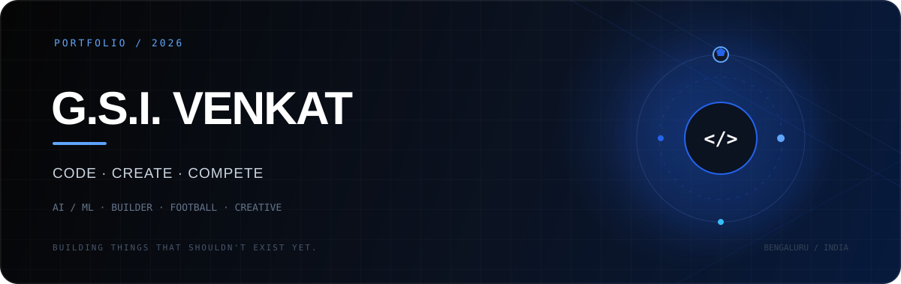

<div align="center">



<br>

<a href="https://github.com/GSIV2006">

</a>
&nbsp;
<a href="https://www.linkedin.com/in/gsivenkat">

</a>

<br><br>

`AI / ML` &nbsp;·&nbsp; `BUILDER` &nbsp;·&nbsp; `FOOTBALL` &nbsp;·&nbsp; `CREATIVE`

</div>

---

---

<div align="center">

### `HELLO, I'M VENKAT.`

</div>

I'm a **Computer Science Engineering student specialising in Artificial Intelligence & Machine Learning at REVA University, Bengaluru.**

I like building things.

Software.  
Events.  
Ideas.  
Teams.  
Occasionally things that break at 2 AM.

I'm interested in the space where **technology, creativity and people** overlap.

---

<div align="center">

`01` &nbsp;&nbsp; **TECH**  
`02` &nbsp;&nbsp; **FOOTBALL**  
`03` &nbsp;&nbsp; **CREATIVE**  
`04` &nbsp;&nbsp; **COMMUNITY**

</div>

---

## 01 / TECH

### Things I've built

<table>
<tr>
<td width="50%" valign="top">

### LEGALENS

**AI × Legal Metrology**

An AI-powered compliance system that analyses packaged commodities using OCR, field extraction and a rule engine.

Built for **Smart India Hackathon 2026**.

`Python` `FastAPI` `PaddleOCR`  
`React` `SQLAlchemy` `AI/ML`

</td>

<td width="50%" valign="top">

### FLOWGUARD AI

**AI × Web3**

A blockchain-focused hackathon project exploring how AI and decentralised technologies can work together.

`Algorand` `Polygon`  
`MetaMask` `Pera Wallet` `AlgoKit`

</td>
</tr>

<tr>
<td width="50%" valign="top">

### IoT SYSTEMS

**Hardware × Software**

Connected sensor systems and dashboards built around real-world environmental data.

`ESP8266` `DHT11` `BMP280`  
`BH1750` `Arduino` `Streamlit`

</td>

<td width="50%" valign="top">

### WHAT'S NEXT?

Probably something I haven't thought of yet.

That's kind of the point.

</td>
</tr>
</table>

---

## 02 / FOOTBALL

<div align="center">

### BEFORE I STARTED WRITING CODE, I WAS LEARNING HOW TO LEAD A TEAM.

</div>

Football has been a major part of my life.

I've played competitively from a young age, captained teams for years and played at club-level competition.

It taught me things that coding eventually reinforced:

```text
LEADERSHIP        →  Make decisions when nobody knows the answer.

TEAMWORK          →  The best player isn't always the most important player.

PRESSURE          →  Perform anyway.

FAILURE           →  Learn. Reset. Go again.

CONSISTENCY       →  Show up.
```

And yes, I'm a **Messi guy.**

---

## 03 / CREATIVE

### The part that doesn't fit on a resume.

Before technology became such a big part of my life, there was **theatre**.

School drama.  
Performances.  
Public speaking.  
Creative projects.  
Eventually, leadership within theatre.

That experience stayed with me.

It probably explains why I care about **storytelling, visual design, presentations and how an idea is experienced**, not just whether it technically works.

I don't want something to simply function.

**I want it to feel good.**

---

## 04 / COMMUNITY

### AWS CLOUD CLUB — REVA UNIVERSITY

I'm part of the **PR team at AWS Cloud Club, REVA University**.

I've worked on the creative, promotional and organisational side of technical events, ideathons and workshops.

Some of the events I've been involved around:

`Bengaluru Tech Week`  
`IdeateBLR`  
`Build on Web3`  
`AI / Cloud Workshops`

There's something satisfying about watching an idea go from:

```text
"we should probably do this"

              ↓

"okay, let's actually do it"

              ↓

"wait... people are actually here"
```

---

## THE STACK

<div align="center">


<br><br>

`Python` · `C` · `JavaScript` · `React` · `FastAPI`  
`SQL` · `Git` · `Docker` · `Arduino` · `AI/ML` · `Computer Vision`

</div>

---

## CURRENTLY

<table>
<tr>
<td>

**LEARNING**

Artificial Intelligence  
Machine Learning  
Computer Vision  
Cloud

</td>
<td>

**BUILDING**

Projects  
Experiments  
Hackathon ideas  
Things that may or may not work

</td>
<td>

**IMPROVING**

Code  
Design  
Communication  
Leadership

</td>
</tr>
</table>

---

## A FEW RANDOM FACTS

```text
01  I have spent years playing football.

02  I care probably too much about how presentations look.

03  I like technology, but I don't want my entire personality to be technology.

04  I enjoy learning languages.

05  I genuinely enjoy turning ideas into things people can actually use.

06  I'm still figuring out what I want to build next.
```

---

## GITHUB

<div align="center">


<br><br>


</div>

---

<div align="center">

### G.S.I. VENKAT

`CODE` &nbsp; `CREATE` &nbsp; `COMPETE`

<br>

<a href="https://github.com/GSIV2006">GitHub</a>
&nbsp;&nbsp;·&nbsp;&nbsp;
<a href="https://www.linkedin.com/in/gsivenkat">LinkedIn</a>

<br><br>


</div>